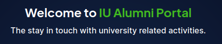

# Introduction

Website providing services for Innopolis University Alumni

## Project Description

This website involves the ability to keep up with events happening in the univeristy, register for elective courses attendance and request a pass to enter university for different purposes.

## Demo

Watch the [Demo](features.md#demo) to see the website

## Developer guide

Jump to the [developer guide](dev/developer_guide.md) if you want to build and run this project locally

## Licence

The innoalumniportaldocs is released under the [MIT Licence](https://github.com/TheSharpOwl/inno-alumni-portal?tab=MIT-1-ov-file#readme)
